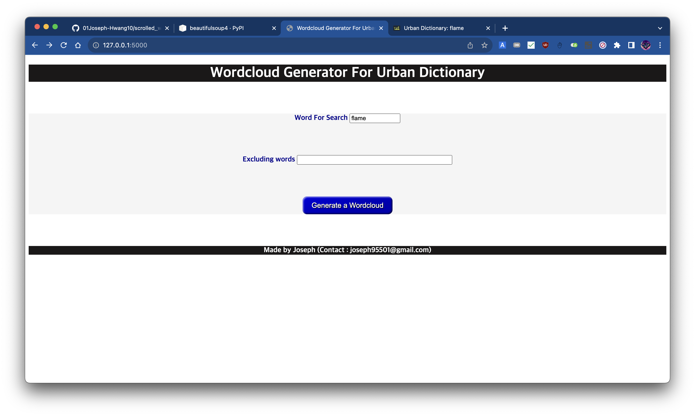
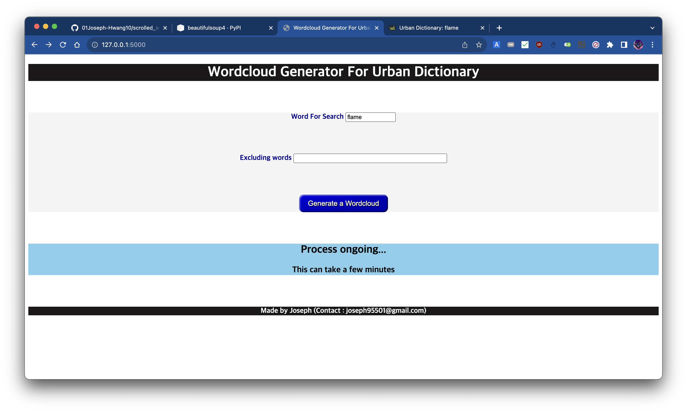
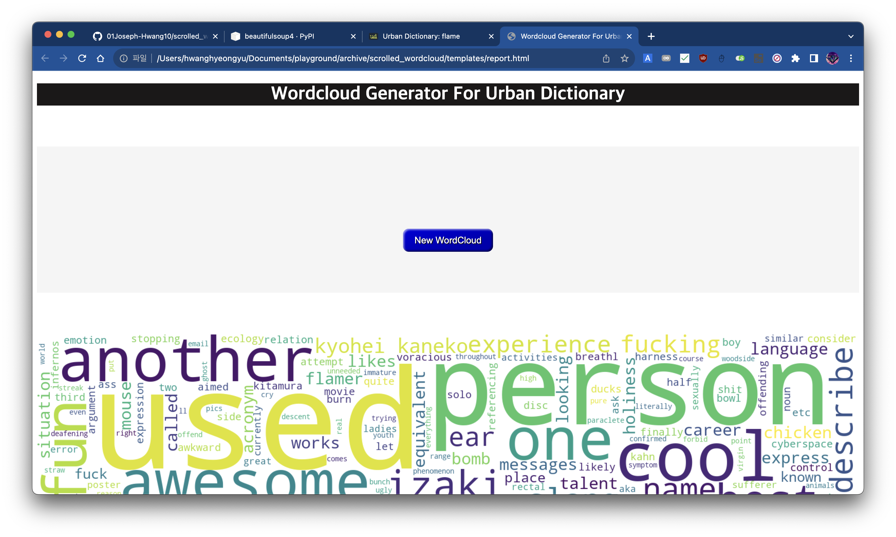
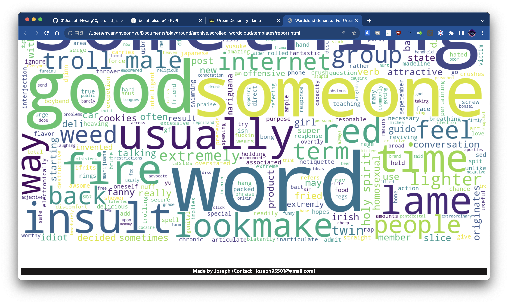

# scrolled_wordcloud

Urban Dictionary에서 가져온 단어와 관련한 정보를 바탕으로 **특정한 단어가 어떤 연관 단어를 가지고 있는지**를 Word Cloud를 통해 표시하는 간단한 프로그램.

고등학교 2학년때 데이터 사이언스에 관심이 있어 만들어보게 되었으며, 이 프로젝트를 통해 프로그래밍에 입문하게 되었습니다. 이 프로젝트를 통해 데이터 마이닝, 데이터 시각화의 기본과 웹의 기본 (HTML, CSS), HTTP 통신의 기본을 알 수 있었습니다.

# Tech Stack

- Python
- Flask
- Requests
- Wordcloud
- BeautifulSoup4
- HTML/CSS

# Showcase

## 키워드 입력

## 로딩 화면

## 결과 화면

# 프로젝트의 경과

## R을 통한 워드 클라우드 구현

Scrolled Wordcloud는 처음에는 R로 구현되었습니다. ([word_cloud.R](./word_cloud.R) 참조)

그러나 R wordcloud 패키지가 더 이상 maintain 되지 않는 것으로 보였고, 그 당시에는 이를 해결하는데 굉장히 큰 어려움을 겪었습니다.

에러 해결을 위해 열심히 구글링 하던 도중 데이터 분석과 관련해 Python이라는 언어 또한 존재한다는 것을 알게 되었고, 이에 Python에 새로 입문하게 되었습니다.

## Python을 통한 워드 클라우드 구현

Python과 `requests`, `bs4`, `wordcloud` 모듈 등을 종합해 워드클라우드를 생성하는 스크립트를 작성하였습니다. ([main.py](./main.py) 참조)

프로그램은 UrbanDictionary의 웹페이지를 크롤링해 단어와 관련된 정보를 가져오고, 이를 바탕으로 워드 클라우드를 생성해 static/image 폴더에 저장합니다.

이로써 워드클라우드를 만드는 본래의 프로젝트 목적은 달성하였으나, 기존의 터미널 창에서 word를 입력받아 워드클라우드를 생성하는 것은 사용자 친화적이지 못하다고 판단하였습니다.

돌아서 생각해보면 CLI로 워드클라우드를 생성하는 것이 훨씬 편한 방법이였지만, 그 당시에는 이를 웹 페이지를 통해 input을 받고 워드클라우드를 생성하여 웹 페이지에 표시하는 간단한 애플리케이션을 구현하고자 하는 욕심이 있었고, 이에 Flask를 통해 웹 서버를 구현하였습니다.

## 웹 서버 구현

Flask를 통해 웹 서버를 구현하였습니다. ([server.py](./server.py) 참조)

## Input Phase

웹 서버는 사용자가 웹 페이지에 접속하면, 웹 페이지에 단어를 입력할 수 있는 input을 표시합니다. 
또한 excluding word에는 워드클라우드에서 제외할 단어를 입력할 수 있습니다.

## Processing Phase

"Generate a Wordcloud" 버튼을 클릭하면 Flask 서버에서 워드클라우드를 생성하는 동안 로딩 화면을 표시하게 됩니다.
Flask는 [main.py](./main.py)를 실행시켜 워드클라우드를 생성하고, 생성된 워드클라우드를 static/image 폴더에 저장합니다.

## Result Phase

워드클라우드 생성이 완료되면 Flask 서버는 이를 웹 페이지에 표시합니다.

또한 유저는 "New Wordcloud" 버튼을 클릭하여 새로운 워드클라우드를 생성할 수 있습니다.
